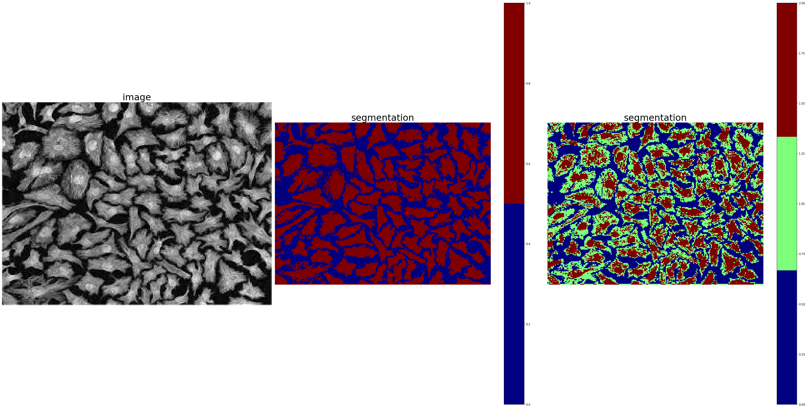

demo_segmentation.py

    
    (1) Global thresholding
        
    (2) Spatially adaptive binary thresholding
        
    (3) Moving average binary thresholding
    
    (4) Region growing segmentation
    
    (5) color segmentation
    
    (6) kmeans segmentation

Global thresholding: 
Original (left), segmentation with 2 classes (center), and segmentation with 3 classses (right) 

  

Spatially adaptive binary thresholding: 
Original (left), segmentation with 2 classes (right) 

  

Moving average binary thresholding: 

  

Region growing segmentation: 

  

Color segmentation: 

  

Kmeans segmentation: 

  

